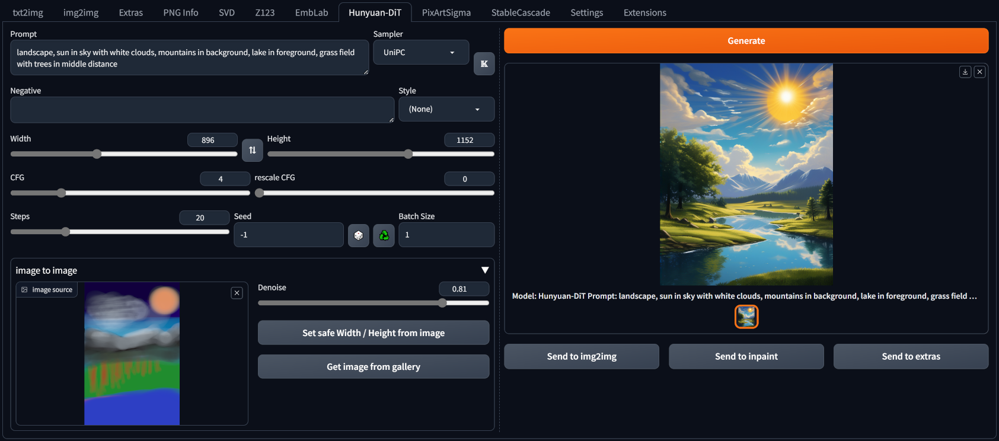
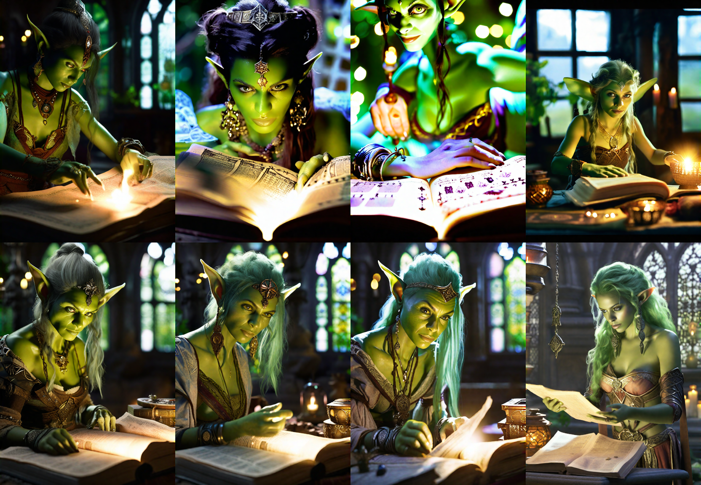

## Hunyuan-DiT for webui ##
### Forge tested, probably A1111 too ###
I don't think there is anything Forge specific here.
### works for me <sup>TM</sup> on 8GB VRAM, 16GB RAM (GTX1070) ###

---
## Install ##
Go to the **Extensions** tab, then **Install from URL**, use the URL for this repository.
>[!IMPORTANT]
> needs *diffusers 0.30.0* or newer

Easiest way to ensure suitably up-to-date diffusers is installed is to edit **requirements_versions.txt** in the webUI folder.
```
diffusers>=0.30.0
```
You might also need to update:
```
tokenizers>=0.19
transformers>=4.40
huggingface-hub>=0.23.4
```
(these are the versions I have installed)

---
### screenshot ###
not current UI, but similar




---
### downloads models on first run - ~13.4GB (optionally +5.6GB for variants) ###


---
<details>
<summary>Change log</summary>
#### 07/08/2024 ####
* diffusers 0.30.0 finally released, so now we have:
	* v1.2 of HunyuanDiT (distilled variant as default)
	* controlnet - will fit into 8GB VRAM (actually ~7GB), but you'd best not be doing much else at the same time. If inference becomes very slow or fails, you've run out of VRAM. Control images must be preprocessed, you can use controlnet in the main txt2img tab for this.
	* whatever else I added/fixed/broke in the meantime

#### 27/07/2024 ####
* added drawing of masks for image to image. Load/copy the source image into the mask, to use as a template.
* added option to keep models loaded

#### 24/07/2024 ####
* added SuperPrompt button (ꌗ) to rewrite simple prompts with more detail. This **overwrites** the prompt. Read about SuperPrompt [here](https://brianfitzgerald.xyz/prompt-augmentation). Credit to BrianFitzgerald for the model. (all my alternate model extensions are updated to use this; the model is loaded to a shared location so there's no wasted memory due to duplicates.)

#### 10/07/2024 ####
* improved yesterday's effort. More compatibility, multi-line, etc.

#### 09/07/2024 ####
* some code cleanups
* added prompt parsing to automatically fill in details like seed, steps, etc.

#### 05/07/2024 ####
* added guidance cut off control: switch to CFG 1.0 after some steps for faster generation. The earlier the switch, the more effect on quality. A late switch might not hurt quality at all.

#### 04/07/2024 ####
* added toggle button to center the latents during inference. This is something that can be very effective with sd1.5 and sdXL (but not sd3). Tends to change the results significantly with HYdit, but doesn't break them, so it's included for experimentation.

#### 03/07/2024 ####
* added quickset for image resolution, included sizes are the recommended ones (and would be enforced if resolution binning were enabled, which it isn't).
* tweaked Florence-2: model now runs on GPU so is faster.

#### 02/07/2024 ####
* cleaner handling for batch after understanding the code a bit better - why repeat over the second dimension, then take use a view to get the right shape, when it is easier to just repeat over the first dimension? Other diffusers pipelines do it too.
* fixed image to image: changed method of added noise when I added masking, which was an error.
* removed **Euler** and **Euler A** samplers as they seem very bad.

#### 01/07/2024 ####
* fix for batch, tested with diffusers versions 0.29.1 and 0.29.2. On my low-end hardware, this takes *n* times longer to generate, up to the point where it starts hitting shared memory, then it gets *really* slow.
* model selection now via dropdown, in preparation for v1.2 (not much information yet, needs a code update, so still have v1.1 as default)
* (controlnet: waiting for diffusers update)

#### 29/06/2024 ####
* added lora support, Tencent original form (with strength control) and pre-converted diffusers form (ignores strength control). Of course, there are already alternate form loras available which I can't load. Some sort of conversion script may be possible. Generation will end early, with a console message, for those loras.
* mask for image to image

#### 25/06/2024 ####
* added option to caption using Florence-2, in image to image section. 'P' button toggles overwriting prompt, results always written to console.
* minor code improvements

#### 17/06/2024 ####
* minor addition to save noise colour settings to infotext

#### 16/06/2024 ####
* added v1.1. Enabled by default, but optional by using the obvious button. I think only the transformer has changed, so 5.64GB extra download (same for Distilled, if used). From brief tests, it does seem to be a step-up.
* option to not use T5 text encoder
* settings to colourize the initial noise. This offers some extra control over the output and is near-enough free. Leave strength at 0.0 to bypass it.
* experimental double prompting - subprompts for each text encoder. Split prompts with '|', first subprompt for CLIP, second for T5. If not used: same prompt sent to both, same as previous behaviour.

#### 12/06/2024 ####
* code cleanup, handles the text encoders manually, better for VRAM usage. In good conditions, no speed up; but bad conditions are harder to hit.
* moved styles to unique file

#### 08/06/2024 ####
* added support for the distilled version, which is better when using fewer steps. I download only the distilled transformer, so the cost is ~5.6GB rather than another 13GB. Toggle the D icon, top-right of left column: lit up means using the distilled version. Downloaded on demand, cached locally. Should this be new default?

#### 07/06/2024 ####
* !! don't apply i2i denoise strength when not doing i2i, late night me forgot to copy that over from the PixArt implementation
* enabled guidance rescale for testing. It's good, very similar method used in my cfgFade extension.

#### 05/06/2024 ####
* reduced VRAM, no longer flirting with shared memory
* caching of prompt embeds to avoid text encoder processing if prompt and negative not changed
* img2img, same method as used with PixArt

#### 04/06/2024 ####
Initial release, dips into shared memory too easily. K icon (top-right of left column) toggles use of Karras sigmas for the samplers. Seemed useful with PixArt + Cascade, so why not here?
</details>

---
### image2image progression with a nice denoise ###


---
### example for cfg, steps, rescale cfg ###
Of course, always same prompt, seed, sampler. Non-distilled version.

From left to right:
* cfg: 2, 4, 8, 8
* steps: 20, 20, 20, 40
Top row: 0 rescale; bottom row: 0.75 rescale



---
Generating with 8GB VRAM is possible. Using CFG 1 saves some VRAM and is considerably faster, but still slower than equivalent resolutions with sdXL or PixArt. Using small resolutions (768x768) seems to give very poor/broken results. Resolution binning is NOT enabled (width/height would be automatically adjusted to 'supported' values) as this seems to cause issues along borders.

---

### example ###
prompt: photograph of a kintsugi bowl of steaming dumplings on a rustic wooden table


