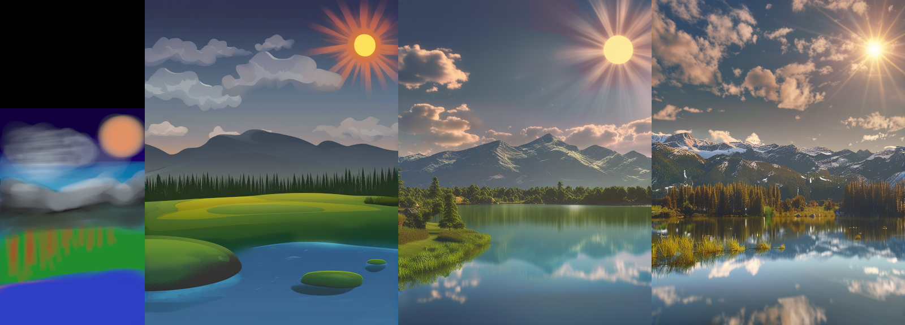

## Hunyuan-DiT for webui ##
### Forge tested, probably A1111 too ###
I don't think there is anything Forge specific here.
### works for me <sup>TM</sup> on 8Gb VRAM, 16Gb RAM (GTX1070) ###

---
## Install ##
Go to the **Extensions** tab, then **Install from URL**, use the URL for this repository.

---
### screenshot ###
almost current UI, imagine a 'D' icon next to the 'K'


---
### downloads models on first run - ~13.4GB (optionally +5.6GB) ###
### needs updated *diffusers 0.28.1* ###

Easiest way to ensure necessary diffusers release is installed is to edit **requirements_versions.txt** in the webUI folder.
```
diffusers>=0.28.1
```

---
#### 12/06/2024 ####
* code cleanup, handles the text encoders manually, better for VRAM usage. In good conditions, no speed up; but bad conditions are harder to hit.
* moved styles to unique file

#### 08/06/2024 ####
* added support for the distilled version, which is better when using fewer steps. I download only the distilled transformer, so the cost is ~5.6GB rather than another 13GB. Toggle the D icon, top-right of left column: lit up means using the distilled version. Downloaded on demand, cached locally. Should this be new default?

#### 07/06/2024 ####
* !! don't apply i2i denoise strength when not doing i2i, late night me forgot to copy that over from the PixArt implementation
* enabled guidance rescale for testing. It's good, very similar method used in my cfgFade extension.

#### 05/06/2024 ####
* reduced VRAM, no longer flirting with shared memory
* caching of prompt embeds to avoid text encoder processing if prompt and negative not changed
* img2img, same method as used with PixArt

#### 04/06/2024 ####
Initial release, dips into shared memory too easily. K icon (top-right of left column) toggles use of Karras sigmas for the samplers. Seemed useful with PixArt + Cascade, so why not here?

---
### image2image progression with a nice denoise ###



---
### example for cfg, steps, rescale cfg ###
Of course, always same prompt, seed, sampler. Non-distilled version.

From left to right:
* cfg: 2, 4, 8, 8
* steps: 20, 20, 20, 40
Top row: 0 rescale; bottom row: 0.75 rescale


---
Generating with 8GB VRAM is possible. Using CFG 1 saves some VRAM and is considerably faster, but still slower than equivalent resolutions with sdXL or PixArt. Using small resolutions (768x768) seems to give very poor/broken results. Resolution binning is NOT enabled (width/height would be automatically adjusted to 'supported' values) as this seems to cause issues along borders.

---

### example ###
prompt: photograph of a kintsugi bowl of steaming dumplings on a rustic wooden table


