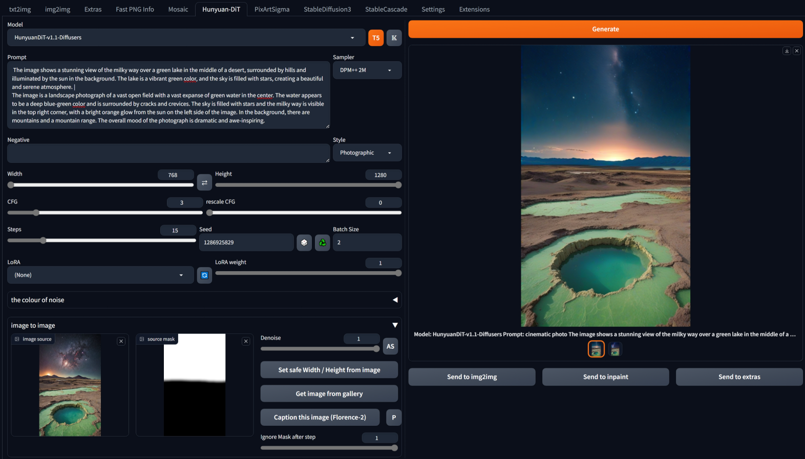

## Hunyuan-DiT for webui ##
### Forge tested, probably A1111 too ###
I don't think there is anything Forge specific here.
### kinda-sorta-works for me <sup>TM</sup> on 8Gb VRAM, 16Gb RAM (GTX1070) ###

---
### screenshot ###
current UI




---
### downloads models on first run - ~13.4GB ###
### needs updated *diffusers 0.28.1* ###

Easiest way to ensure necessary versions are installed is to edit **requirements.text** and **requirements_versions.txt** in the webUI folder.
```
diffusers>=0.28.1
```

---

Generating with 8GB VRAM is just about possible, but starts using shared memory easily. Therefore: *slow*. Using CFG 1 keeps generation within 8GB VRAM. Using small resolutions (768x768) seems to give very poor results, stay around 1024x1024. Resolution binning is NOT enabled (width/height would be automatically adjusted to supported values) as this seems to cause issues along edges.

I might keep working on this, but probably not. I've tested the usual ways to reduce VRAM usage, to no avail. Also, the results I'm getting are *variable*.

The pipeline has a 'latents' parameter, so img2img should be easy to add.

---

### example ###
photograph of a kintsugi bowl of steaming dumplings on a rustic wooden table


